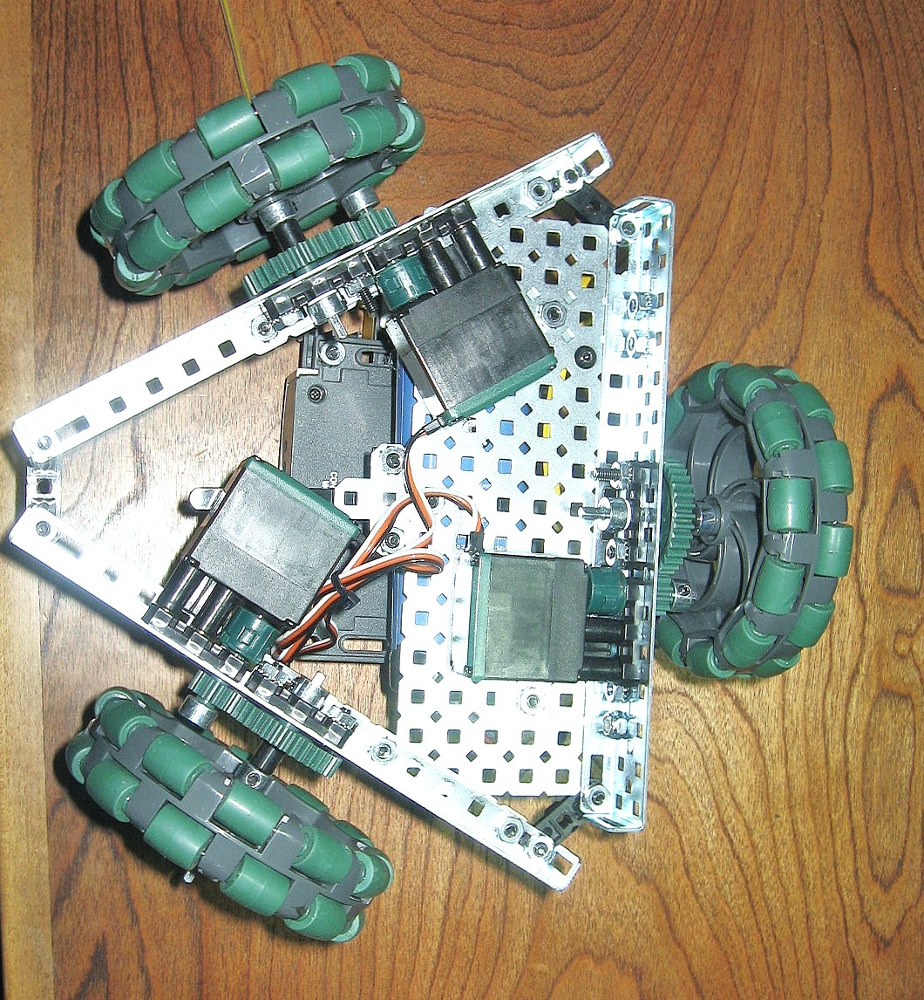
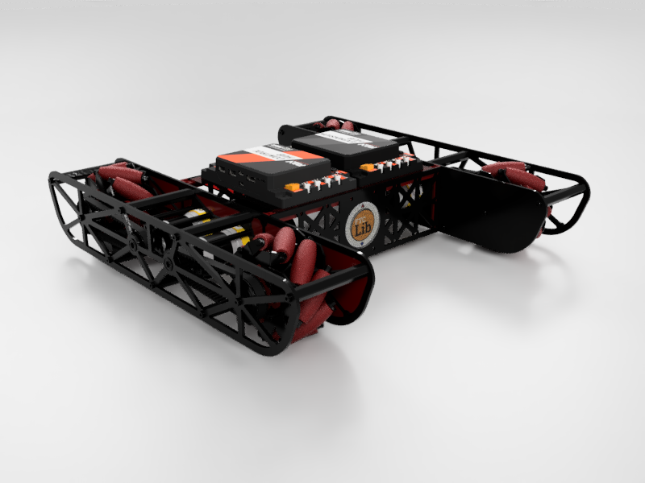

# Drivebases

All of the FTCLib drivebase classes are based on the `RobotBase` abstract class. This is functionally similar to the [RobotDriveBase ](https://github.com/wpilibsuite/allwpilib/blob/50db653f8d864c594c6a9ab7dd5a0f45b4483a03/wpilibj/src/main/java/edu/wpi/first/wpilibj/drive/RobotDriveBase.java)class in WPILib. It contains:

* An enumerator for the different motor types \(i.e. the indices of the motors in the array\)
* Maximum possible speed for the drivebase to approach
* A clipping method between a minimum and maximum value
* Normalization of wheel speeds
* A `stop()` method
* Square input method

All of the following drive types are available for use in FTCLib. All that's needed for the user to do is plug in the values to an instantiation of the object.

## Differential

A differential drive is one that has two motors or motor groups
 on either side of the robot. Each side acts as a connected set or motor group. There are two types of drive systems here. You can use the tank and arcade control schemes with a differential drive.

### Arcade

Arcade drive use a y-value input from the controller and a value from
 the turn stick. We know that when the turn stick is pushed left, the right
 side should move forward and the left side should move backwards.
 Therefore, since pushing the turn stick to the left returns a negative value, it should be added to the left speed and subtracted from the right speed.

### Tank

Tank drive uses a y-value input from the left and right sticks. The sticks
 control their respective side of the robot.

## Holonomic

In FTCLib, we shortened holonomic drive to the generic term H-Drive. A holonomic drive is one that can move in omnidirectional space, which is why it is often called an omnidirectional drive. There are different sub-types of holonomic drivebases.

### Holonomic Drivebases

#### Three Wheel H-Drive

A three wheel holonomic drivebase, otherwise known as a "Kiwi" or "Killough," is a drivetrain with omnidirectional motion while utilizing three omniwheels.

#### X-Drive

An X-drive is a holonomic base that has four omniwheels positioned into an "X" shape as seen below.

#### Mecanum

A mecanum drivebase is a type of holonomic drive that utilizes [mecanum wheels](https://en.wikipedia.org/wiki/Mecanum_wheel) for movement.

For more information on mecanum drives, please watch this video: [https://www.youtube.com/watch?v=8rhAkjViHEQ](https://www.youtube.com/watch?v=8rhAkjViHEQ).

### Control Scheme

Like how the differential drive has two different control schemes, so too does holonomic. There is field-centric and robot-centric. The only difference is that there is some sort of interpolation of the robot's heading \(the direction the forward face is pointing globally\).

#### Robot-Centric

Robot-centric assumes that each push of the joystick is in relation to the local position of the robot—this means that whenever the user pushes the drive stick forward, the robot will drive in the direction of its front-facing side.

#### Field-Centric

Field-centric assumes that each push of the joystick is in relation to the global position of the robot—this means that whenever the user pushes the drive stick forward, the robot will move away from the driver no matter its orientation. This is done by rotating the direction of the joystick clockwise by an angle measurement equivalent to the global heading of the robot.

