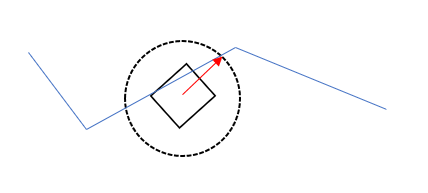

# Pure Pursuit

The pure pursuit algorithm in FTCLib is developed so that the user only needs to add the desired waypoints and call the `followPath()` method in the [Path](https://github.com/FTCLib/FTCLib/blob/master/FtcLib/src/main/java/com/arcrobotics/ftclib/purepursuit/Path.java) class. To use this, you need to pass the [mecanum](https://docs.ftclib.org/ftclib/features/drivebases#mecanum) drivetrain as well as the odometry for the robot. Once the method is finished, it will return true or false depending on if it was successful or not.

As an alternative, you can call the `loop()` method and directly input your odometry positions there. Make sure you update the odometry positions with each iteration of the loop.

## What is Pure Pursuit?

Pure pursuit, otherwise designated as "PP," is a path tracking algorithm that calculates the robot velocity in order to reach a designated look-ahead point from the current position. It loosely follows a path determined by a set of waypoints, which are coordinates on the field. What the pure pursuit controller does is create a circle of determined radius and follow the path by "looking ahead" with the circle and seeing where it intersects with the path. The robot's heading orientation is then compared to the radius that connects the center of the robot to that intersection. It then moves in correspondence. The radius size can be updated for each waypoint you enter into the path for specificity.



The robot continues to follow this intersection at real-time. This is how the robot "follows" the designated path. It is essentially a p controller for the heading that has the robot move at the fastest possible speed around some path.

### Waypoints

There are five types of waypoints: start, general, interrupted, point-turn, and end. The starting waypoint represents the first point in the path; conversely, the ending waypoint is the last point in the path.

A general waypoint is a point where the robot performs its ordinary pursuit algorithm with the look-ahead method. A point-turn waypoint is a type of general waypoint that stops at the given point, turns, and then traverses to the next waypoint. An interrupted waypoint is a type of point-turn waypoint where other actions can occur, such as picking up a skystone.

#### Creating Waypoints

You can create a waypoint by calling the various constructors.

**StartWaypoint**

```java
// empty constructor
StartWaypoint waypoint_1 = new StartWaypoint();
// Pose2d
waypoint_1 = new StartWaypoint(pose2d);
// X and Y coordinates
waypoint_1 = new StartWaypoint(x, y);
// Translation2d
waypoint_1 = new StartWaypoint(translation2d);
```

**GeneralWaypoint**

```java
// empty constructor
GeneralWaypoint waypoint_2 = new GeneralWaypoint();
// X and Y coordinates
waypoint_2 = new GeneralWaypoint(x, y);

/**
 * More detailed constructors
 */
waypoint_2 = new GeneralWaypoint(
    translation2d, rotation2d,
    movementSpeed, turnSpeed,
    followRadius
);
waypoint_2 = new GeneralWaypoint(
    pose2d, movementSpeed, turnSpeed,
    followRadius
);
waypoint_2 = new GeneralWaypoint(
    x, y, movementSpeed,
    turnSpeed, followRadius
);
waypoint_2 = new GeneralWaypoint(
    x, y, rotationRadians,    // if you have a preferred angle
    movementSpeed, turnSpeed,
    followRadius
);
```

**PointTurnWaypoint**

As you will see here, a "buffer" is a sort of expected error. This sets up a tolerance given that the robot might be a bit offset from the desired position or rotation.

```java
// empty constructor
PointTurnWaypoint waypoint_3 = new PointTurnWaypoint();

/**
 * More detailed constructors
 */
waypoint_3 = new PointTurnWaypoint(
    translation2d, rotation2d,
    movementSpeed, turnSpeed,
    followRadius, positionBuffer,
    rotationBuffer
);
waypoint_3 = new PointTurnWaypoint(
    pose2d, movementSpeed,
    turnSpeed, followRadius,
    positionBuffer, rotationBuffer
);
waypoint_3 = new PointTurnWaypoint(
    x, y, rotationRadians, movementSpeed,
    turnSpeed, followRadius,
    positionBuffer, rotationBuffer
);
waypoint_3 = new PointTurnWaypoint(
    x, y, movementSpeed,
    turnSpeed, followRadius,
    positionBuffer, rotationBuffer
);
```

**InterruptWaypoint**

The `action` here is an [InterruptAction](https://github.com/FTCLib/FTCLib/blob/master/FtcLib/src/main/java/com/arcrobotics/ftclib/purepursuit/actions/InterruptAction.java), which is an interface that the user can implement to create a custom action to occur at this point. A recommendation is to pair this with the [command paradigm](../command-base/command-system/) that FTCLib provides.

```java
// empty constructor
InterruptWaypoint waypoint_4 = new InterruptWaypoint();

/**
 * More detailed constructors
 */
waypoint_4 = new InterruptWaypoint(
    translation2d, rotation2d,
    movementSpeed, turnSpeed,
    followRadius, positionBuffer,
    rotationBuffer, action
);
waypoint_4 = new InterruptWaypoint(
    pose2d, movementSpeed, turnSpeed,
    followRadius, positionBuffer,
    rotationBuffer, action
);
waypoint_4 = new InterruptWaypoint(
    x, y, rotationRadians,
    movementSpeed, turnSpeed,
    followRadius, positionBuffer,
    rotationBuffer, action
);
waypoint_4 = new InterruptWaypoint(
    x, y, movementSpeed,
    turnSpeed, followRadius,
    positionBuffer, rotationBuffer,
    action
);
```

**EndWaypoint**

```java
// empty constructor
EndWaypoint waypoint_5 = new EndWaypoint();

/**
 * More detailed constructors
 */
waypoint_5 = new PointTurnWaypoint(
    translation2d, rotation2d,
    movementSpeed, turnSpeed,
    followRadius, positionBuffer,
    rotationBuffer
);
waypoint_5 = new PointTurnWaypoint(
    pose2d, movementSpeed,
    turnSpeed, followRadius,
    positionBuffer, rotationBuffer
);
waypoint_5 = new PointTurnWaypoint(
    x, y, rotationRadians, movementSpeed,
    turnSpeed, followRadius,
    positionBuffer, rotationBuffer
);
```

### Intersections

An intersection is the point where the follow distance represented by a circle around the robot meets the drawn path derived from the waypoints. The "best intersection" is determined by either waypoint order or heading. This intersection point where the circle meets the path is where the robot will move to. The pure pursuit algorithm determines the best intersection and calculates the motor powers needed to reach said position. This updates with each loop, so the intersection point can change with each step due to the movement of the robot.

## Using `followPath()`

An important note for the pure pursuit algorithm is that it only works well with odometry. You can use the various odometry systems provided by FTCLib. An important thing to note is that `followPath()` makes use of the [Odometry](https://github.com/FTCLib/FTCLib/blob/master/FtcLib/src/main/java/com/arcrobotics/ftclib/kinematics/Odometry.java) abstract class and the [mecanum drivebase](https://docs.ftclib.org/ftclib/features/drivebases#mecanum). Then, the method will call the loop method and do everything for you.

