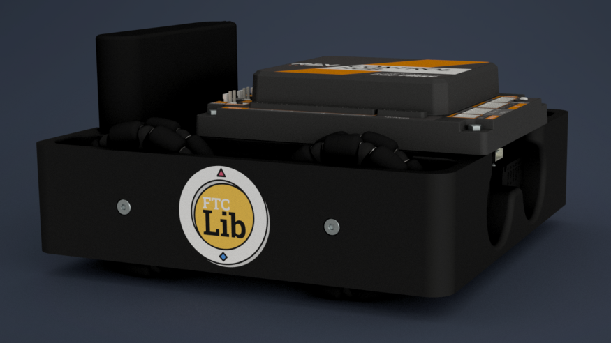

# Support FTCLib

FTCLib is solely community-driven and currently is not the standard tool for programming in FTC. In order to get to that point, we need to garner a large audience. If you have worked with our library, consider using some of our branding tools that you can find under the [brand package](https://github.com/FTCLib/FTCLib/tree/v1.1.0/brand) in our repository. Spreading news by word of mouth also works and make sure to point them towards [our website](http://ftclib.org).

You can use our logo to put a sticker on your robot as seen here:

We would also greatly appreciate it if you would contribute to FTCLib. Make sure to read our [contributing page](https://github.com/FTCLib/FTCLib/blob/v1.1.0/.github/CONTRIBUTING.md) on the GitHub for information on how to contribute. We are always willing to accept new pull requests. In fact, FTCLib is built on community contributions and would not have been possible if not for our contributors:

## Developers

* Jackson - FRC 6905 alum
* Pranav - FTC 5387 alum
* Peter - FTC 5890
* Purav - FTC 14614

## Collaborators

* Jiaming - FTC 6964
* Ryan - FTC 1002
* Jaran - FTC 6133 alum
* Ethan - FTC 12864

## Contributors

* Xing - FTC 15303
* Sam - FTC 4314
* Colin - FRC 3457
* Shengming - FTC 4781 alum
* Noah - FTC 16626 alum
* Sebastian - FTC 18341
* Abhay - FRC 492 alum
* Dan - FTC 7026
* Michael - FTC 14470
* Jeremiah - FTC 10641

